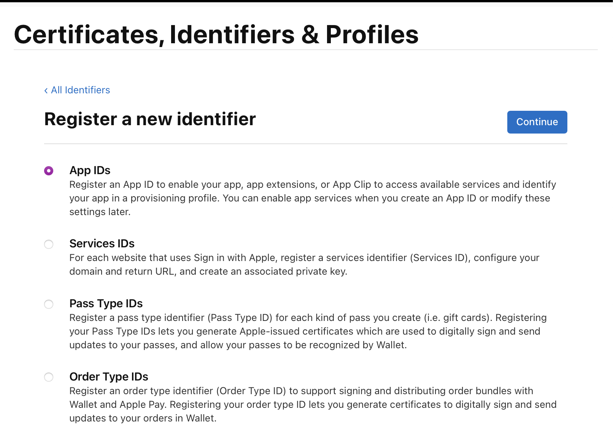

# FQAuth

FQAuth sets up for you everything you need in your app and on the server to enable Sign in with Apple in your app. Apple has done a lot of nice stuff for us here. But there's still a lot to handle as an indie dev. FQAuth handles for you or gives you a great open-source starting point to modify.

## Goals

From an indie dev perspective, you could deploy this micro-service to a free-tier of hosting, while your main app runs on different provider. Or include in your Kubernetes deployment behind your load balancer. Ease of deployment for newcomers to DevOps is a priority.

## Infrastructure required

- Postgres
- Redis
- Ability to run Docker images

## How

I stream my contributions, which would include code, codereviews, writing tickets, and diagrams. My twitch username is [FullQueueDeveloper](https://twitch.tv/FullQueueDeveloper) & link is in my profile

## Main flow:

Receive a login request and return an JWT that can be exchanged for a session JWT. Both of these are returned on an initial request. The JWT contains the roles that user is authorized for, stored in Postgres

Looking to support Sign in with Apple and Sign in with Google to start, since those are the two biggest mobile OS's at the moment. Support login from an iOS/Mac/Android app as well as a website.

Other features

- Apple server notifications
- Google equivalent (if available)
- unit tests
- Vapor queues to run cleanup tasks, or ping apple
  Future maybes handle in app purchases as well? Since mostlikely, we would want the JWT to include the current subscription tiers.

## Build targets:

- Docker container
- Helm chart
- Vapor SDK for other microservices to consume the JWTs (optional)
- iOS client SDK (optional)
- Android client SDK (optional)
- JS SDK (optional)

## Sponsors

If you learn anything or make a few bucks from this repo, please sponsor me on GitHub. https://github.com/sponsors/FullQueueDeveloper/

A huge thank you to the following for keeping the dream alive! 💜🗽

1. [0xLeif](https://github.com/0xLeif)

## License

MIT

## Local development

These are suggestions. Of course it is completely customizable to your taste.

0. Install Postgres and Redis.

   brew install postgresql redis

1. Copy `.env.sample` to `.env`, and `.env.testing.sample` to `.env.testing`

2. Create local development and test databases

   swish local-postgres create

3. Run migrations

   swift run FQAuthServer migrate -y

4. Run the tests

   swift test

## Deploying & setting up a new app with FQAuth

1. Create bundle ID on https://developer.apple.com/account > "Certificates, Identifiers & Profiles" > "Identifiers" 
2. Create a new app on https://appstoreconnect.apple.com/apps, selecting the bundle ID from step 1. Add "Sign in with Apple" capability. 
3. Create a services key under https://developer.apple.com/account > "Certificates, Identifiers & Profiles" > "Keys". Be sure to enable "Sign in with Apple" by checking the checkbox next to it. Download the key store it in a safe place. 

4. Create an account on a hosting provider of your choice. Continue following directions in one the deployment-specific READMEs.

- [Heroku](./Deploy/Heroku/README.md)
- [Kubernetes](./Deploy/Kubernetes/README.md)
- [Helm](./Deploy/Helm/README.md)
- [Fly.io](./Deploy/Fly.io/README.md)
